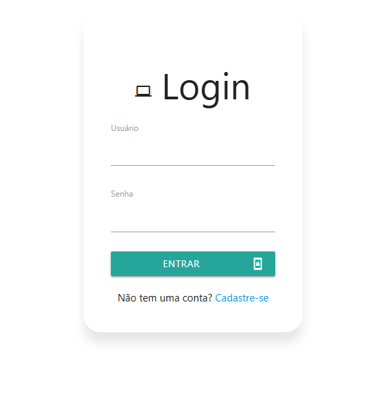

# Tela de login
Projeto simples para praticar o desenvolvimento Front-End para representar a autenticação de usuário em uma tela de login, utilizando apenas HTML, CSS e JS.

## Implementações ao projeto
- Implementado o framework __Materialize CSS__ para alterar o visual básico/padrão da página e dar mais vida a visualização da tela de login.
- No próprio projeto do __Materialize CSS__ foi implemento também o __Google Icons__.

<!--
## Imagens do projeto

-->

## Imagens do projeto final

